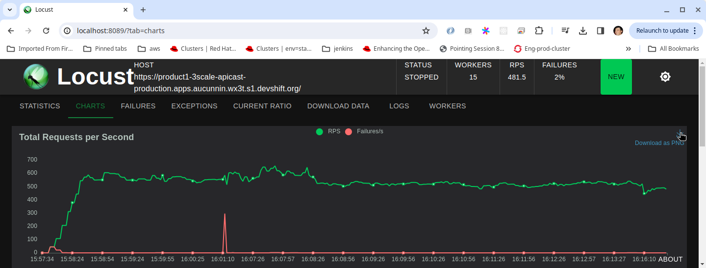

# Setup for 3scale 2.15 Performance Testing Using Locust

## Setup 3scale

Required logged in on the oc cli to an osd cluster 
Clone the following repo
```bash
git clone git@github.com:3scale-labs/3scale-perf-setup.git
cd 3scale-perf-setup
```

Run the scripts in the following order
```bash
./setup_db.sh
./setup_apimanager.sh
./setup_monitoring.sh
./setup_product.sh
```
>**NOTE:** You may need to `chmod 771 setup_*` before you can run the above scripts

## Setting up locust

Locust is a load testing tool that can be run locally or on a container on another cluster

* Fork repo - [https://github.com/integr8ly/locust-integreatly-operator](https://github.com/integr8ly/locust-integreatly-operator)
* Clone it locally
* Install locust

```bash
pip3 install locust 
```

**Config**

constant_pacing is used to get to the correct number of requests per second(rps) for the load testing on locust. It also takes into account the number of users. It is the inverse of constant_throughput. In order to increase the rps you need to decrease the constant pacing value. When changing this be sure to only update in small increments. More info on this function can be found [here](https://docs.locust.io/en/stable/api.html#locust.wait_time.constant_pacing).

| SKU | calculation | constant_pacing | users | RPS | 
| ---- | ----------- | --------------- | ----- | --- |
| 1 k | 100,000 ÷ 60 ÷ 60 ÷ 24 = 1.15740741 | 9.25 |11 | 1.157 |
| 1 million | 1 million ÷ 60 ÷ 60 ÷ 24 = 11.5740741 | 1.25 | 14 | 11.57 |
| 5 million | 5 million ÷ 60 ÷ 60 ÷ 24 = 57.8703704 | 0.207| 12 | 57.87 |
| 10 million | 10 million ÷ 60 ÷ 60 ÷ 24 = 115.740741 | 0.09 | 10 | 110 |
| 20 million | 20 million ÷ 60 ÷ 60 ÷ 24 = 231.481481 | 1 | 232 | 232 |
| 50 million | 50 million ÷ 60 ÷ 60 ÷ 24 = 578.703704 | 0.01 | 32 | 550 |
| 100 million | 100 million ÷ 60 ÷ 60 ÷ 24 = 1157.40741 | 0.05 | 59 | 1150 |


**NOTE:** we need to alter the constant_pacing value. We can set the constant_pacing variable to the value in the table above. This can be updated in locustfile.py

e.g.
```python
wait_time = constant_pacing(9.25) 
```

<br>

## Auth file
Locust requires an auth file. 

TOML is the recommended file format.

## TOML
```
[3scale]
url = "localhost:8000" # 3scale tenant URL
param = "?user_key=<key_here>"

```


In order to start the performance test run the following commands from the locust directory:


```bash
pipenv shell
locust
./start.sh
```


In your browser navigate to localhost:8089

To stop the test run


```bash
./kill.sh
```

<br>

## Running locust on a VM

### **EC2 Instance AWS**

Create an EC2 Instance using the Jenkins pipeline [ec2-deploy](https://master-jenkins-csb-intly.apps.ocp-c1.prod.psi.redhat.com/job/ManagedAPI/job/ec2-deploy/). You will need an ssh key.

Once this is created, ssh into the instance:


1. Install [AWS CLI](https://aws.amazon.com/cli/)
2. Ensure that the EC2 instance can take traffic from your IP address:

```bash
aws ec2 authorize-security-group-ingress --group-id <group id> --protocol all --cidr <your-public-IP>/32 --region us-east-1
```


3. SSH into the instance
    1. In your local terminal create a file pipelineKey.pem and open the file for editing
    2. Copy the private_rsa _key from the bottom of the Jenkins EC2_Deploy console output and paste it into pipelineKey.pem, save the file.
    3. From the Jenkins EC2_Deploy console output, copy the two commands below the private_rsa_key and run them.
    4. You should be in the EC2 instance :  example - [ec2-user@ip-10-11-128-177]$
4. Set up Locust
    1. Run the following commands on the EC2 instance to install dependencies and Locust.

```bash
ssh-keygen -t rsa -N "" -f .ssh/id_rsa
cat .ssh/id_rsa.pub >> .ssh/authorized_keys
ssh -o StrictHostKeyChecking=no -i ~/.ssh/id_rsa localhost 'exit'
sudo dnf install python3.11 -y
pip3.11 install locust
mkdir locust
```


2. Copy the required files from your local machine

```bash
scp -i /path/key-pair-name.pem locust/* ec2-user@\[instance-IPv6-address\]:locust
```


5. Add your public key to the authorized_keys of the ec2 instance
    1. First you will need to get your public key from your local machine.  Open another terminal and run the following command.

```bash
cat ~/.ssh/id_rsa.pub
```

2. Copy the output and return to the EC2 instance.  Paste the public key to the end of authorized_keys and save the file. On the EC2 instance authorized_keys can be found in ~/.ssh/authorized_keys

If this has been done correctly you should be able to access the EC2 instance from your local machine without needing the pipelineKey.pem file.

<br> 
Start the performance testing by running the start script


```bash
~/locust/start.sh
```

You can then navigate to the locust UI via http://&lt;remote.url>:8089

<br>

## Gathering Stats

We gather stats for our runs in this spreadsheet https://docs.google.com/spreadsheets/d/1HV577_tQ_f-HRcIN9zYBB6sSIpYo04DSiQMqYe1hEds/edit?usp=sharing


Row 14 to 27 are generated with this script https://github.com/3scale-labs/3scale-perf-setup/blob/main/capture_resource_metrics.sh

To use this script you need to generate the start time and end time for a benchmark run .

> **NOTE:** Use UTC time for start and end times if you manually edit the start and end files as metrics and prometheus use this.


```bash
# usually run before test
date -u +%Y-%m-%dT%TZ > perf-test-start-time.txt
# usually run after test
date -u +%Y-%m-%dT%TZ > perf-test-end-time.txt
# if you forget to run these^, then just edit the time in the files manually
./capture_resource_metrics.sh
# sample output
120
88
87.00999999999998
492.3283386230469
338.51558685302734
304.44136810302734
9.815000000000003
8507.255737304688
6246.451996527777
3.4002671738072996
3.4002671738072996
6904.54296875
3.869765581481475
3.869765581481475
```
<br>
From the locust report you can get the 90th percentile. Before stopping the tests, download the test data here:


<br> 


Get can be taken straight from the chart. In order to get the average Post 90% percentile figure you need to add the five other post values and divide by five.

The downloaded report can also be added to the relevant jira ticket e.g.[THREESCALE-10784 report](https://issues.redhat.com/secure/attachment/13146744/report_1709309411.282224.html). 
After you click download report, you must click download again.
It is downloaded as a html file and can be open in the browser. 

<br>
You can download the load testing chart as a png file


You can then add it to jira and the spreadsheet also e.g. [THREESCALE-10784 image](https://issues.redhat.com/secure/attachment/13148584/image-2024-03-05-11-28-55-235.png)


## Alerts

We have a script that can be run while a load test is running to determine if any alerts are triggered during the load test. This is useful in overnight tests as you can't always be available to look at the dashboards. Its in the [script directory of the integreatly-operator](https://github.com/integr8ly/integreatly-operator/blob/master/scripts/alerts-during-perf-testing.sh)

```bash
# USAGE
# ./alerts-during-perf-testing.sh <optional product-name>
# ^C to break
# Generates two files one for firing and one for pending alerts
#
# PREREQUISITES
# - jq
# - oc (logged in at the cmd line in order to get the bearer token)
```


To view alerts manually, navigate to the redhat-rhoam-obserability namespace, choose Networking and then Routes from the menu on the left. Click on the Location URL for the Prometheus route. Log in with kubeadmin credentials. Then click on the Alerts tab to view their current state.

To check the history

* Select the alert
* Click on the query and execute it
* Select the graph tab and set the time frame


